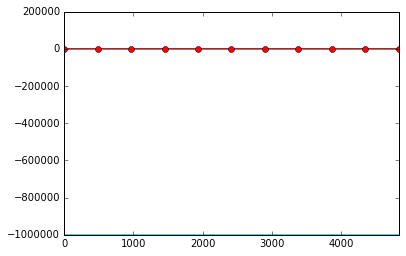
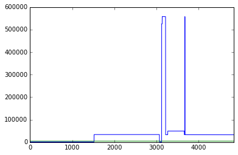
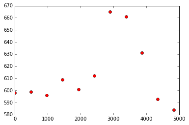
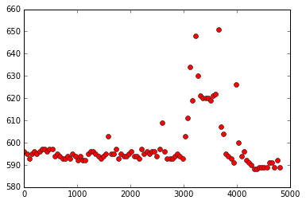

# Détection d'anomalies sur un vol

**Objectif :**
Appliquer des algorithmes pour mettre en évidence la présence de signaux anormaux parmi les milliers de mesures disponibles. Une première idée est tout d'abord de comparer les signaux qui sont censés être égaux. C'est normalement le cas pour les signaux sur les channels A et B, ou encore sur les mesures physiques qui doivent normalement être symétriques par construction de l'avion. 

## Données

On dispose donc des données d'un seul vol, parmi ceux à notre disposition.

**Script :** [Symmetry.py](https://github.com/YuanxiangFranck/PIE_ISAE_Essais_Vol/blob/master/algorithms/Symmetry.py)

## Tests d'égalité de deux signaux

Afin de détecter les signaux qui diffèrent, je procède simplement comme suit :
* L'utilisateur choisit une valeur de l'*erreur* acceptable.
* Le test d'égalité est positif si à tout instant, la différence relative entre les deux signaux est inférieure à l'erreur entrée par l'utilisateur

## Egalité supposée des signaux

Comme dit précédemment, l'idée est d'utiliser la redondance et les symétries de l'avion pour détecter les anomalies.

###Signaux égaux par symétrie
Si je ne m'abuse, les signaux représentant les mêmes mesures physiques sur les deux côtés droite/gauche de l'avion présentent dans leur nom les caractères : **AMSC1** ou **AMSC2**. Il conviendra alors de tester s'ils diffèrent.

Ceci a été implémenté. 

Par exemple, pour le vol **data1**, lancer la fonction *Symmetry_Lateral_One_Flight* avec en argument une erreur de 1 redonnera le nom de tous les signaux supposés égaux mais qui diffèrent avec une erreur relative d'au moins 100% (ce qui est beaucoup), ainsi que les indices temporels correspondants aux différences.

 Dans cet exemple, si on est plus exigeant et que l'on recherche des signaux égaux à 1% près (erreur = 0.01), l'algorithme détecte 799 couples d'anomalies, parmi lesquels le couple **ZTS_ZN2_SNSR_MISC_F_AMSC1_CHA'** et **ZTS_ZN2_SNSR_MISC_F_AMSC2_CHA**. 

L'affichage de ces deux signaux montre bien qu'il y a une différence.

###Signaux égaux par redondance
Dans ce cas de figure, les signaux des channels A et B, mentionnés à la fin de leur nom par les caractères **CHA** ou **CHB**, doivent être égaux. Ce test a été codé.

Par exemple, pour le vol **data1**, lancer la fonction *Symmetry_Channels_One_Flight* avec en argument une erreur de 1 redonnera le nom de tous les signaux supposés égaux mais qui diffèrent avec une erreur relative d'au moins 100% (ce qui est beaucoup), ainsi que les indices temporels correspondants aux différences.

 Dans cet exemple, l'algorithme en trouve 208, parmi lesquels le couple **ZONE1_TAV_DRIV_F_AMSC1_CHA** et **ZONE1_TAV_DRIV_F_AMSC1_CHB**. 

L'affichage de ces deux signaux montre bien qu'il y a une différence.

Si on est plus exigeant et que l'on recherche des signaux égaux à 1% près (erreur = 0.01), alors là, toujours pour ce même vol, l'algorithme détecte 696 couples d'anomalies.

## Affichage du nombre d'anomalies detectées en fonction du temps
Il peut être très interessant de visualiser la date d'occurence de ces anomalies, en particulier pour détecter si elles apparaissent plutôt au début de vol, au milieu ou plutôt en fin de vol.
Pour cela, dans un premier temps, j'ai utilisé un sequençage par fenêtres temporelle. Bientôt, j'aimerai effectuer un séquençage par phase de vol pour estimer s'il une phase est plus propice à ce type d'anomalies de symetrie.

### Division par fenêtres temporelles

 j'ai découpé le vol en fenêtres temporelles de même longueur et, pour chaque fenêtres temporelle, j'ai compté le nombre de signaux qui présentaient au moins une anomalie.

On renseigne dans la fonction **Anomalies_in_Time** la taille de la fenêtre (en pourcentage de la durée de vol total).

Voici les graphs obtenus pour le vol **data1** (avec un seuil d'anomalie de 1%) :
* avec un sequençage grossier (10 fenêtres) : 

* avec un sequençage plus fin (100 fenêtres) : 

On remarque sur ce cas particulier l'existence d'un petit pic qui représente une augmentation de 10% d'anomalies sur une certaine plage temporelle vers le milieu du vol, mais l'augmentation est assez faible.

Il faudrait tester sur d'autres vols pour voir si on retrouve ce motif (ou si d'autres formes apparaissent).

### Division par phases de vol

A coder.