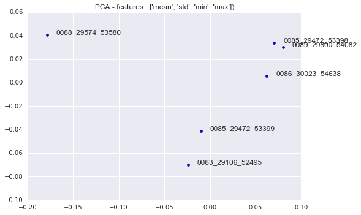
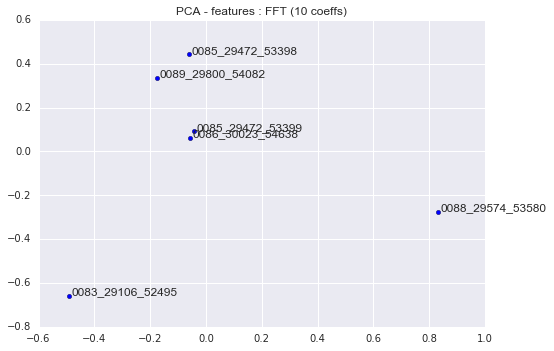
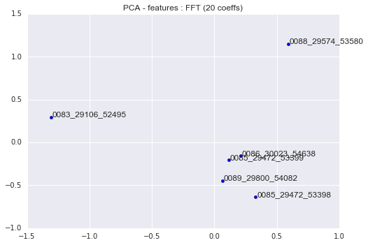
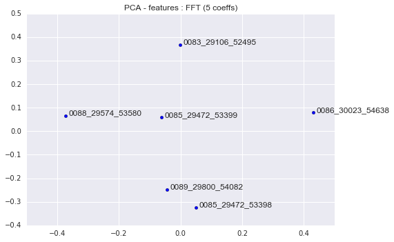
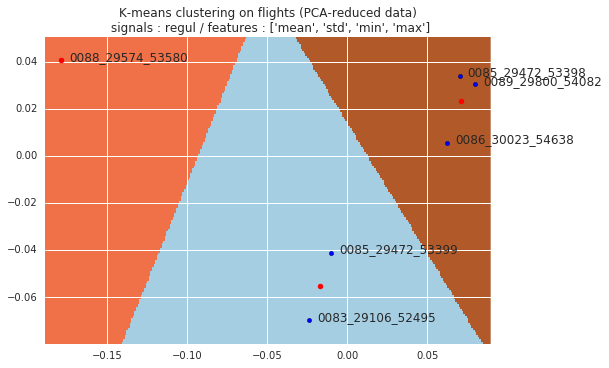
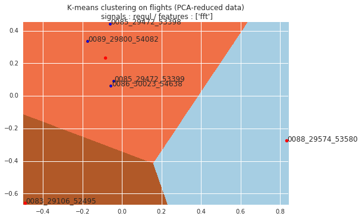

# Détection d'anomalies sur plusieurs vols

**Objectif :**
Appliquer des algorithmes et obtenir des visualisations permettant de mettre en évidence des vols anormaux parmis un ensemble de vols. On veut déterminer quelles sont les pistes les plus intéressantes, et notamment quels sont les meilleurs descripteurs pour un vol entier.

## Données

On dispose des données de 6 vols :
* E190-E2_20001_0083_29106_52495_request.txt
* E190-E2_20001_0085_29472_53398_request.txt
* E190-E2_20001_0085_29472_53399_request.txt
* E190-E2_20001_0086_30023_54638_request.txt
* E190-E2_20001_0088_29574_53580_request.txt
* E190-E2_20001_0089_29800_54082_request.txt

qu'on abrègera par un numéro pour les identifier (E190-E2_20001_XXXX_XXXXX_XXXXX_request.txt).

## regul

Dans un premier temps, je travaille en n'utilisant que les signaux de régulation (signaux continus), sans utiliser les signaux de targets ni les signaux discrets. Il y a donc 50 signaux.

### regul/PCA

La première méthode que j'ai appliquée est une simple visualisation en 2 dimensions par PCA, appliquée sur certaines features extraites de chaque vol. On obtient ainsi 6 points correspondant aux 6 vols dans le plan des directions principales. Des points éloignés les uns des autres indiquent que les vols considérés sont très différents, du point de vue des features sélectionnées.

Les features d'un vol sont constituées des features de chacun des 50 signaux. Si on extrait `n` features sur chaque signal, on obtient donc une matrice de features avec 6 lignes et 50*`n` colonnes.

**On considère les signaux entiers (sur un vol complet), sans utiliser de segmentation par phases de vol.**

1. Features basiques 

**Script :** [n_flights_pca.py](https://github.com/YuanxiangFranck/PIE_ISAE_Essais_Vol/blob/master/algorithms/n_flights_pca.py)

**Features :** mean, std, min, max

2. FFT

**Script :** [n_flights_pca_fft.py](https://github.com/YuanxiangFranck/PIE_ISAE_Essais_Vol/blob/master/algorithms/n_flights_pca_fft.py)

**Features :** 10 plus grands coefficients de la décomposition en série de Fourier

**Features :** 20 plus grands coefficients de la décomposition en série de Fourier

**Features :** 5 plus grands coefficients de la décomposition en série de Fourier

### regul/KMeans

On a constaté que certains vols semblaient différents des autres. On peut donc appliquer un algo de clustering tel que K-Means pour regrouper les vols dans plusieurs groupes. Bien sûr, étant donné le très faible nombre de vols, on n'arrivera pas à des clusters regroupant un grand nombre de points et il est difficile de généraliser. Mais la méthode pourra se révéler efficace pour un plus grand nombre d'échantillons.

Le nombre de clusters donné à K-Means est le paramètre le plus important : il définit le nombre de groupes que l'algorithme va discerner. Ici, on ne peut pas le déterminer de manière générale, mais on le fixera à 3 car on a constaté un groupe assez dense, et 2 vols à l'écart de ce groupe.

**Script :** [n_flights_cluster.py](https://github.com/YuanxiangFranck/PIE_ISAE_Essais_Vol/blob/master/algorithms/n_flights_cluster.py)

**Features :** mean, std, min, max

**Features :** 10 plus grands coefficients de la décomposition en série de Fourier

## targets

Ici, je me servirai également des signaux targets (continus).

## all

Enfin, on prend en compte tous les signaux, y compris les signaux binaires.
