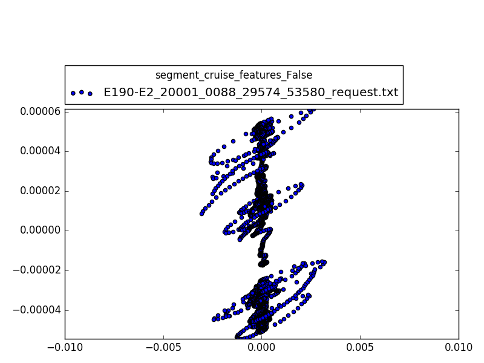

# Clustering des données brut pour chaque phase de vol

## Démarche

1. Récupérer les données
2. Récupérer la partie correspondant au pas de temps
3. Sélectionner des signaux à étudier
4. PCA pour réduire en 2D
5. Afficher les résultats + conclusion

## Étude basique

But créer une routine de clustering pour l'analyse de n vol
Dans un premier temps on travaille avec les données brut pour mieux se les approprier.

### Les signaux utilisées

* WOW_FBK_AMSC1_CHA
* ADSP1 Pressure Altitude (feet)
* ADSP1 Altitude Rate (ft/min) <!-- | alt_rate_signal -->
* ADSP1 Calibrated Airspeed (knots) <!-- | delta_cas_signal -->

### Résultats: signaux brut

### Résultats: signaux + lisage

### Analyse

Mis a part le clustering de la phase "hold" les autres données et clustering
sont peu intéressant.

A ce stage le segmenter ne distingue n'a trouvé de phase 'cruise' que dans un
vol donc ces données sont inutiles.
