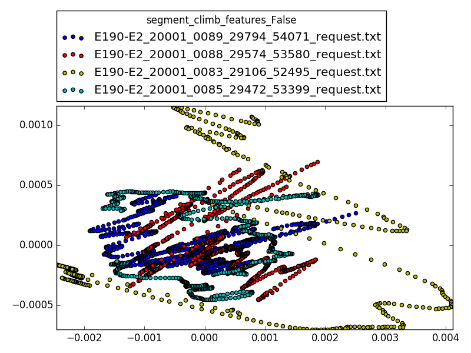
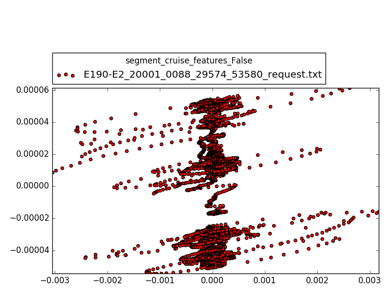
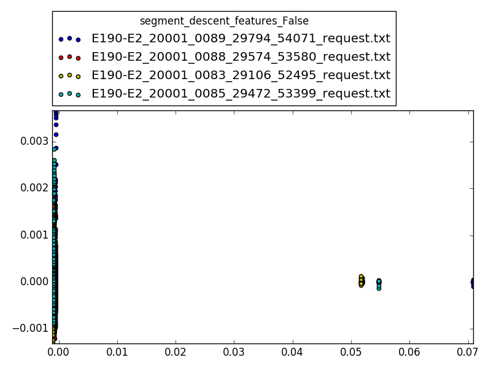
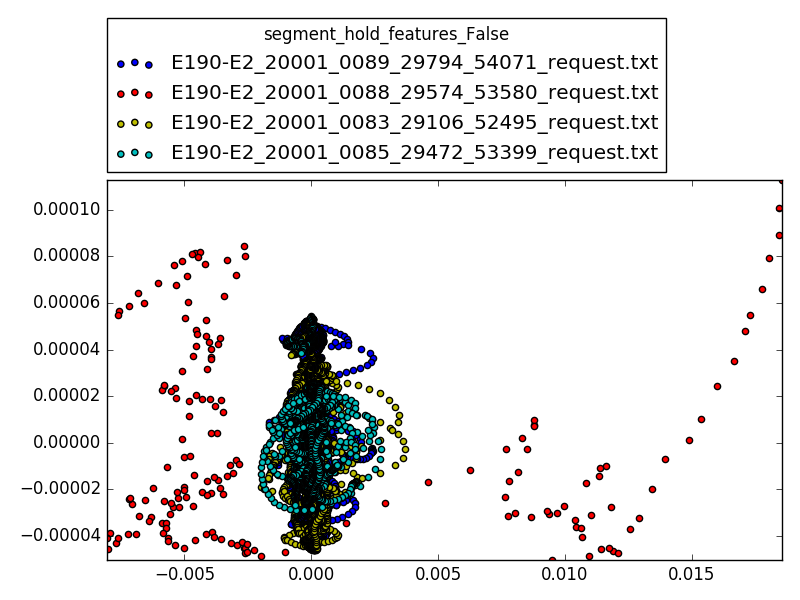
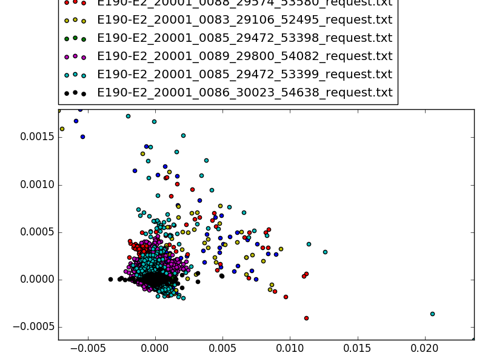
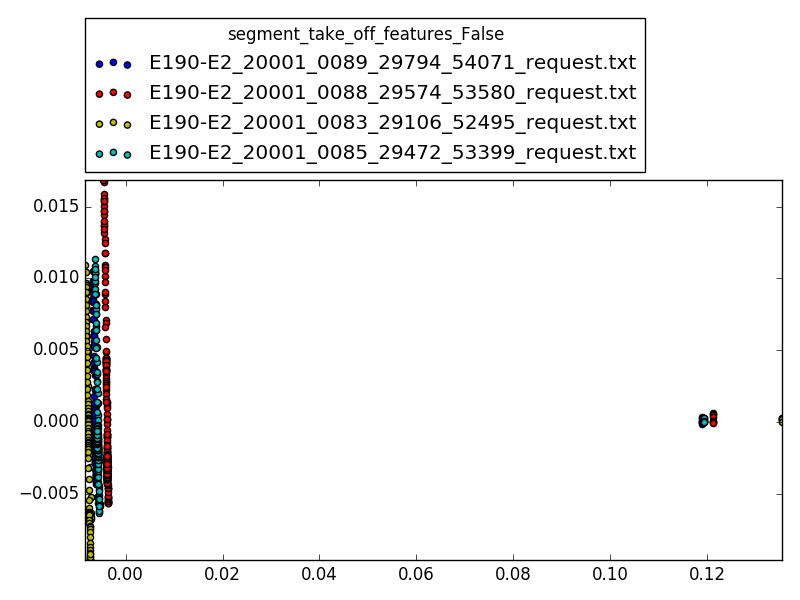

# Démarche

1. Récupérer les données
2. Récupérer la partie correspondant à la phase
3. Sélectionner des signaux à étudier
4. PCA pour réduire en 2D

# Signaux

* WOW_FBK_AMSC1_CHA
* ADSP1 Pressure Altitude (feet)
* ADSP1 Altitude Rate (ft/min)
* ADSP1 Calibrated Airspeed (knots)

# Résultat

## hold

On remarque bien que le premier vol (bleu) se distingue des deux autres
A étudier plus en profondeur...

## climb

Les données sont globalement très proche mais le vol rouge à des parties un peu
différentes.

## Take off / Descent

On peut y reconnaître un pattern qui est suivi par les trois vols.

## Autres

Pas de résultat visible...

# Touts les résultats

