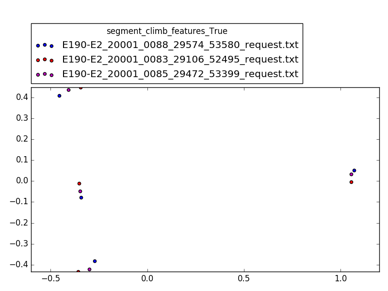
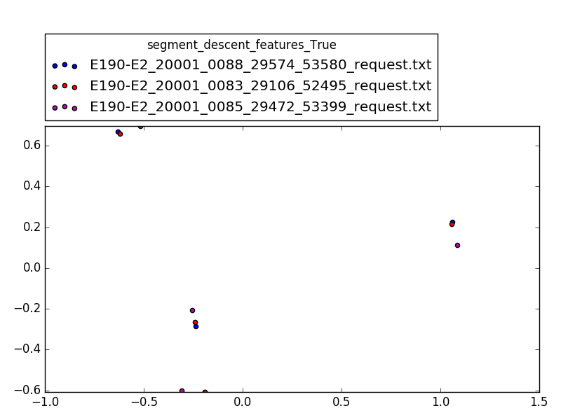
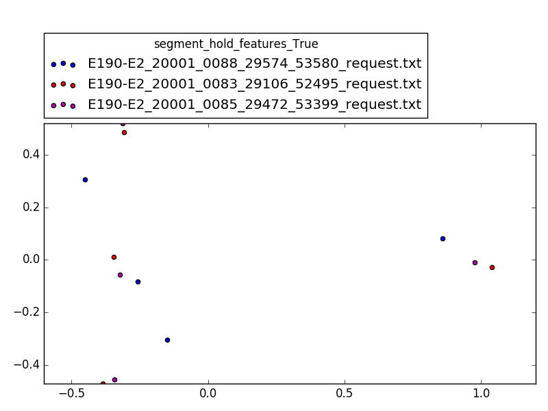
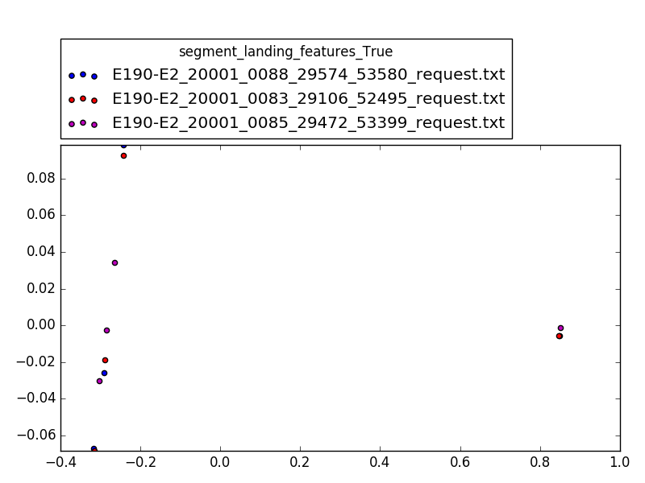
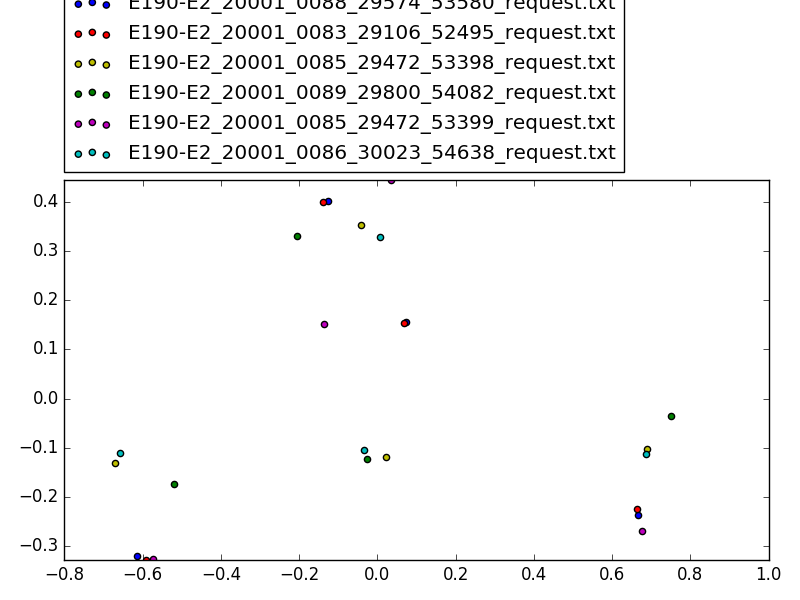
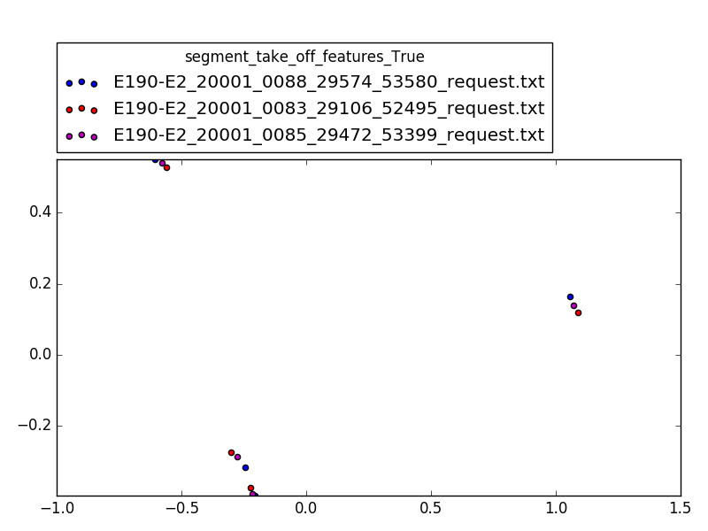

# Démarche

1. Récupérer les données
2. Récupérer la partie correspondant à la phase
3. Sélectionner des signaux à étudier
4. Application des features
5. PCA pour réduire en 2D
# Signaux

* WOW_FBK_AMSC1_CHA
* ADSP1 Pressure Altitude (feet)
* alt_rate_signal
* delta_cas_signal

# Features:

* min
* max
* mean
* covariance

# Résultat

Pas assez de données...

# Touts les résultats

